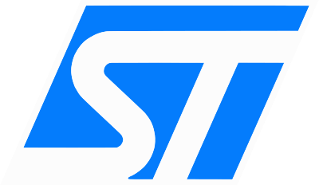
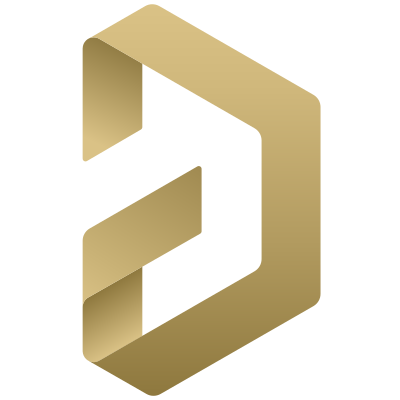
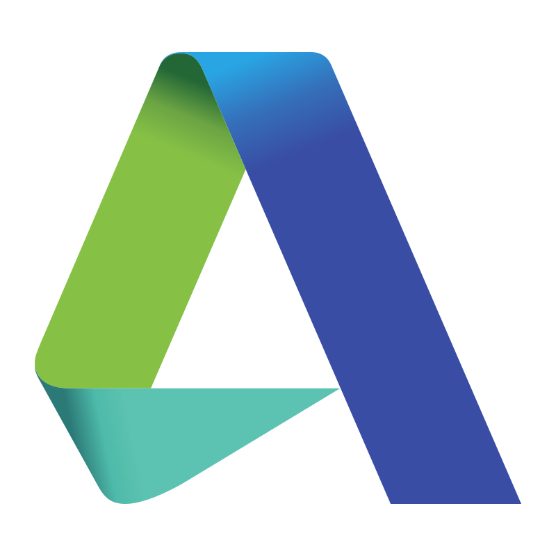
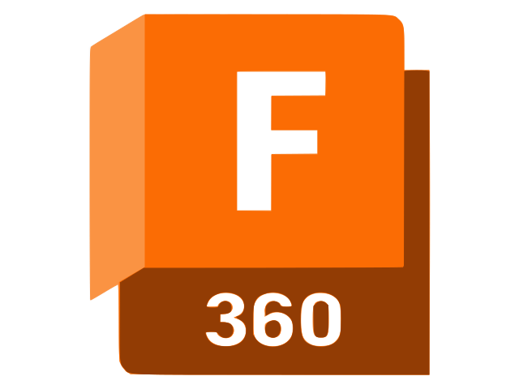
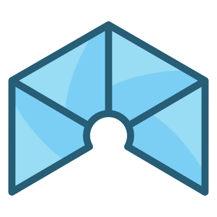
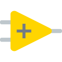
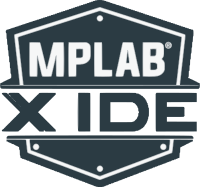

  <h1>Welcome to my profile!</h1>
    
  

  

    
  

### 👨🏻‍💻 About Me :
- ⚙️ I'm an organized, intuitive and detail-oriented person. Biting off more than I can chew is my default mode.
- 🔬 Passionate in building autonomous systems that adds value to human life.
- 💭 Retrospective, Pensive and Envisionative.
- 🎼 In my free time I learn music theory and try to practice on my acoustic guitar and piano.

</> Languages & DevOps:

🛠️ Hardware:

 

💻 Software:

   

🤖 Machine Learning:

  

## 📫 Contact

- Email: [ashifraees@outlook.com](mailto:ashifraees@outlook.com)
- My Portfolio: [Click here](https://ashifraees99.github.io/)

<!-- ## 📊 GitHub Stats

-->
