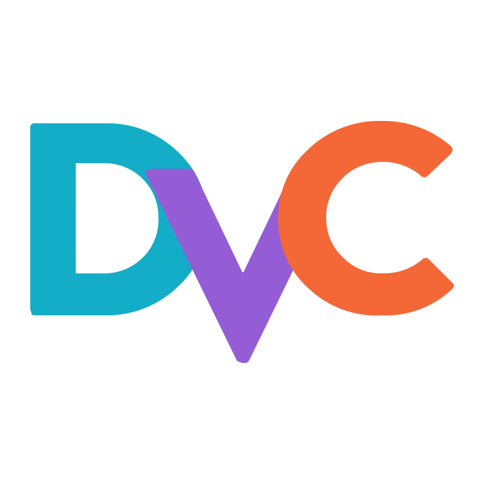
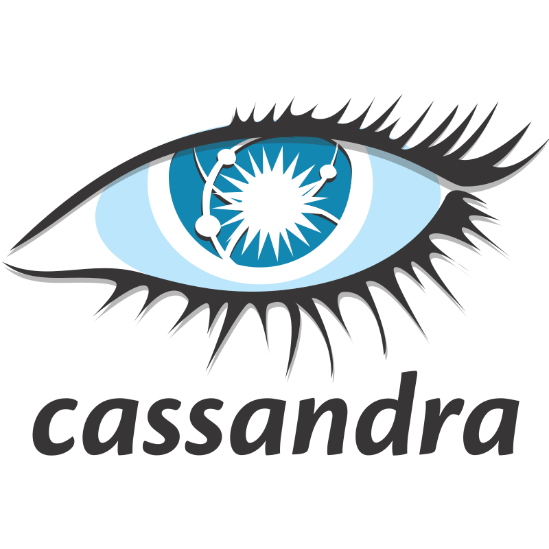

  <h1>Welcome to my profile!</h1>
    
  

  

    
  

### 👨🏻‍💻 About Me :
- ⚙️ I'm an organized, intuitive and detail-oriented person. Biting off more than I can chew is my default mode.
- 📊 Passionate about playing with Data and interpreting them.
- 💭 Retrospective, Pensive and Envisionative.
- 🔬 In my free time I read about new technologies and trends. 

### 🛠️ Tech Stack

#### 💻 Languages

#### 🗃️ Data Ingestion

#### 🔧 DevOps

#### 🤖 Machine Learning

#### 📊 Visualization

## 📫 Contact

- Email: [ar3889@drexel.edu](mailto:ar3889@drexel.edu)
- My Portfolio: [Click here](https://ashifraees99.github.io/)

<!-- ## 📊 GitHub Stats

-->
