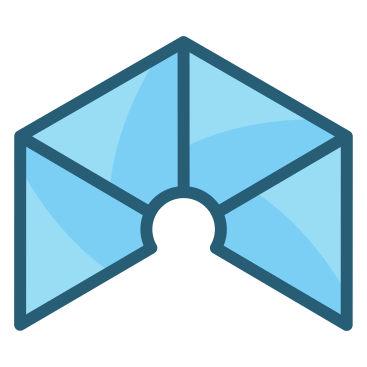
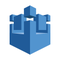
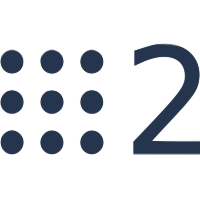
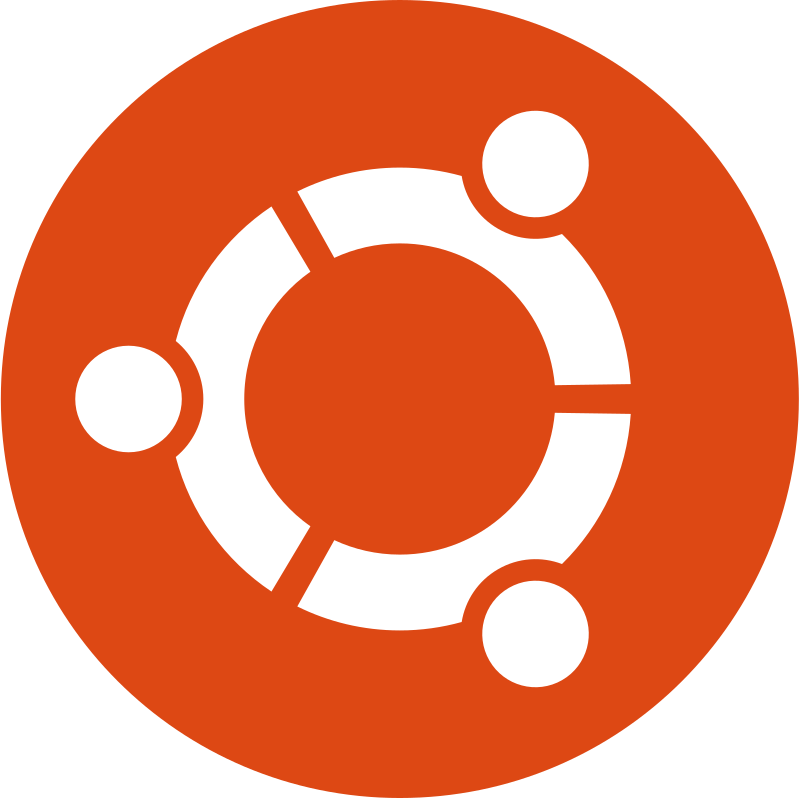
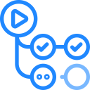

  <h1>Welcome to my profile!</h1>
    
  

  

    
  

### 👨🏻‍💻 About Me :
- ⚙️ I'm an organized, intuitive and detail-oriented person. Biting off more than I can chew is my default mode.
- 📊 Passionate .
- 💭 Retrospective, Pensive and Envisionative.
- 🔬 In my free time I learn music theory and try to practice on my acoustic guitar and piano.

💻 Languages:

🎨 Design & Simulation:

 

🔧 Prototyping:

 

📁 Other:

 

🤖 Machine Learning:

 

🔧 DevOps:

## 📫 Contact

- Email: [ashifraees@outlook.com](mailto:ashifraees@outlook.com)
- My Portfolio: [Click here](https://ashifraees99.github.io/)

<!-- ## 📊 GitHub Stats

-->
